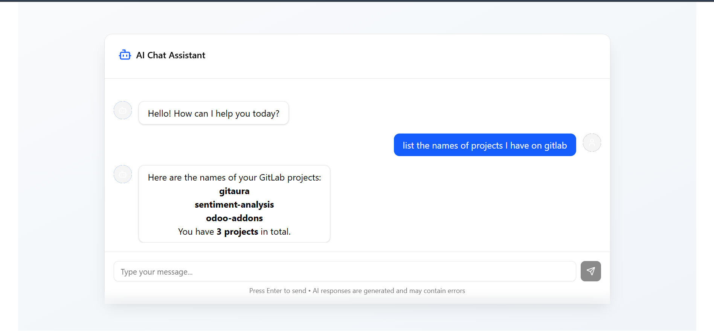
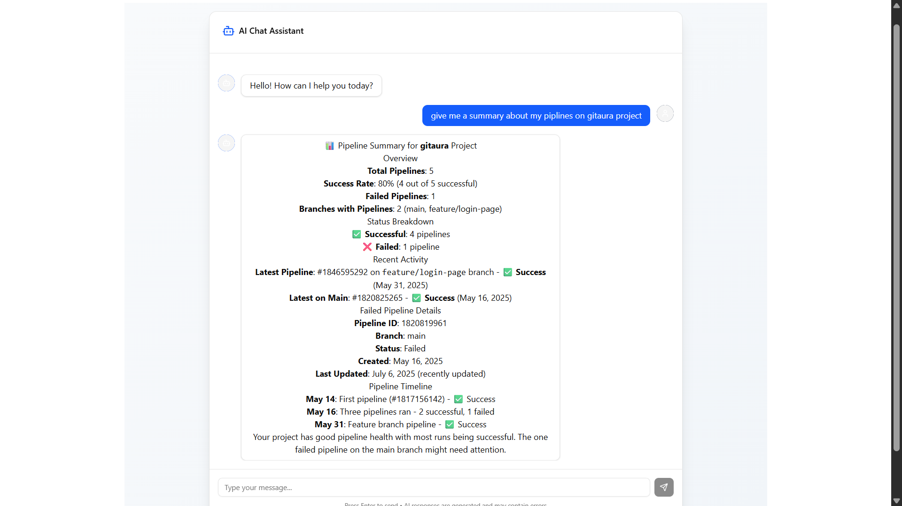
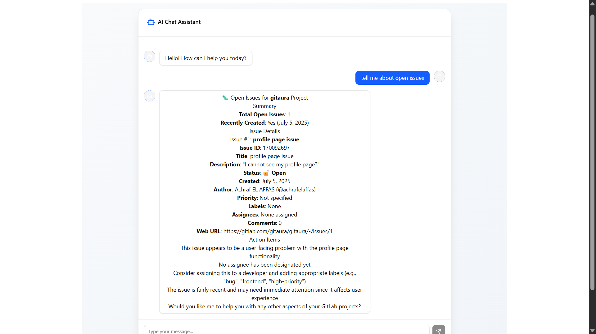
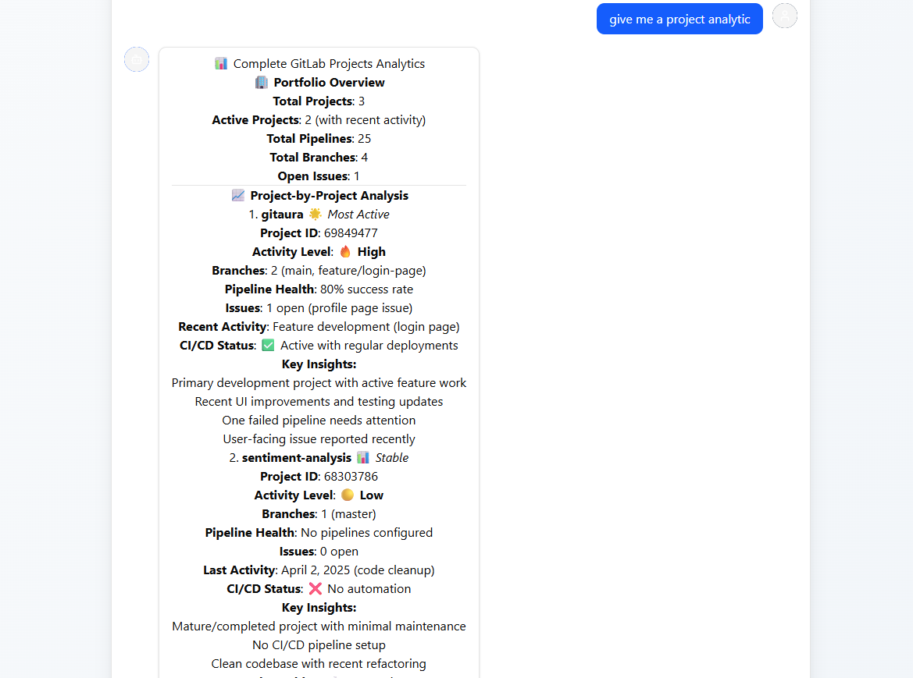
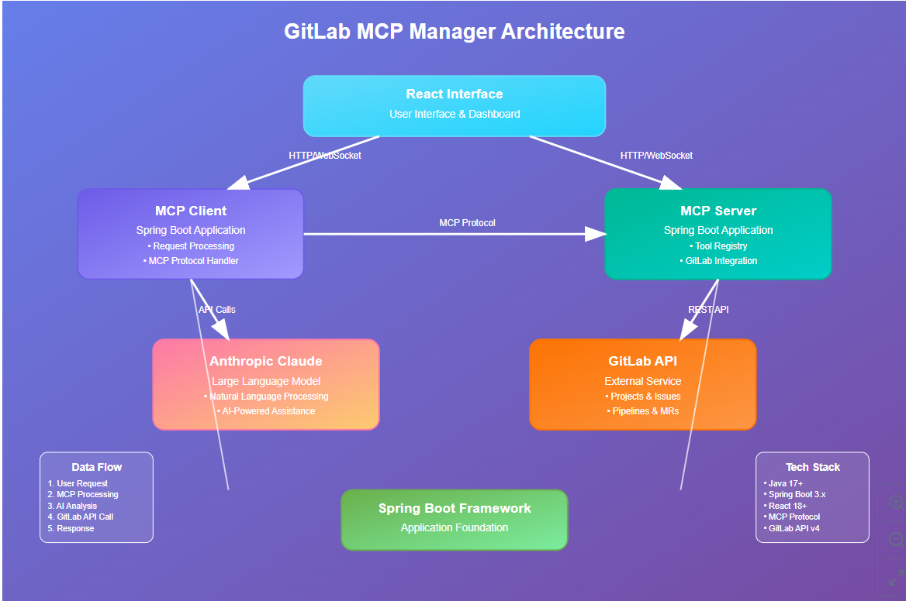

# GitLab MCP Manager


A Model Context Protocol (MCP) project built with Spring AI Boot and Anthropic's Claude model for comprehensive GitLab project management. This tool helps developers efficiently manage GitLab projects, issues, pipelines, and more through intelligent AI assistance.


## Demo



*Interactive demo showing GitLab project management through AI assistance*

## Features


- 🚀 **Pipeline Management**: Monitor, trigger, and analyze GitLab CI/CD pipelines
- 📋 **Issue Tracking**: Create, update, and manage GitLab issues with AI assistance
- 📊 **Project Analytics**: Get insights about project health, activity, and metrics
- 🔍 **Smart Search**: Find issues, merge requests, and commits using natural language
- 🤖 **AI-Powered**: Leverage Claude's capabilities for intelligent project management

### Screenshot Gallery

## Demo

### Pipeline Management


### Issue Tracking


###  Project Analytics



## Architecture



*High-level architecture showing the integration between Spring AI, Anthropic Claude, and GitLab API*

## Prerequisites

- Java 17 or higher
- Maven 3.6+
- GitLab account with API access
- Anthropic API key


## Configuration


## Usage

### Basic Commands

The MCP server provides several tools that can be used through the Claude interface:

#### 1. Get Project Information

```json
{
  "tool": "get_project_info",
  "parameters": {
    "projectId": "123",
    "includeStatistics": true
  }
}
```

#### 2. List Issues

```json
{
  "tool": "list_issues",
  "parameters": {
    "projectId": "123",
    "state": "opened",
    "labels": ["bug", "urgent"]
  }
}
```

#### 3. Get Pipeline Status

```json
{
  "tool": "get_pipeline_status",
  "parameters": {
    "projectId": "123",
    "pipelineId": "456"
  }
}
```

#### 4. Create Issue

```json
{
  "tool": "create_issue",
  "parameters": {
    "projectId": "123",
    "title": "New issue title",
    "description": "Issue description",
    "labels": ["bug", "high-priority"]
  }
}
```

### Advanced Features


#### Smart Project Analysis

Ask Claude to analyze your project:
```
"Analyze the health of project 123, including recent pipeline failures and open critical issues"
```

#### Pipeline Optimization

```
"Review the failed pipelines in project 123 from the last week and suggest improvements"
```

#### Issue Management

```
"Create a summary of all high-priority bugs in project 123 and suggest a resolution plan"
```

## API Documentation

### Available MCP Tools


| Tool Name | Description | Parameters |
|-----------|-------------|------------|
| `get_project_info` | Retrieve project details | `projectId`, `includeStatistics` |
| `list_projects` | List accessible projects | `owned`, `starred`, `search` |
| `list_issues` | Get project issues | `projectId`, `state`, `labels`, `assignee` |
| `create_issue` | Create new issue | `projectId`, `title`, `description`, `labels` |
| `update_issue` | Update existing issue | `projectId`, `issueId`, `title`, `description`, `state` |
| `get_pipeline_status` | Get pipeline information | `projectId`, `pipelineId` |
| `list_pipelines` | List project pipelines | `projectId`, `status`, `ref` |
| `trigger_pipeline` | Trigger new pipeline | `projectId`, `ref`, `variables` |
| `get_merge_requests` | List merge requests | `projectId`, `state`, `target_branch` |
| `create_merge_request` | Create merge request | `projectId`, `source_branch`, `target_branch`, `title` |
| `search_commits` | Search commits | `projectId`, `query`, `since`, `until` |
| `get_project_members` | Get project members | `projectId` |
| `get_project_statistics` | Get project statistics | `projectId` |

### Error Handling


The application includes comprehensive error handling for:
- GitLab API rate limits
- Authentication failures
- Network timeouts
- Invalid project IDs
- Permission errors

## Development

### Project Structure


```
src/
├── main/
│   ├── java/
│   │   └── com/yourpackage/gitlab/
│   │       ├── GitlabMcpApplication.java
│   │       ├── config/
│   │       │   ├── GitlabConfig.java
│   │       │   └── AnthropicConfig.java
│   │       ├── controller/
│   │       │   └── McpController.java
│   │       ├── service/
│   │       │   ├── GitlabService.java
│   │       │   ├── McpService.java
│   │       │   └── AiService.java
│   │       ├── model/
│   │       │   ├── GitlabProject.java
│   │       │   ├── GitlabIssue.java
│   │       │   └── GitlabPipeline.java
│   │       └── mcp/
│   │           ├── McpServer.java
│   │           └── tools/
│   │               ├── ProjectTool.java
│   │               ├── IssueTool.java
│   │               └── PipelineTool.java
│   └── resources/
│       ├── application.yml
│       └── mcp-manifest.json
└── test/
    └── java/
        └── com/yourpackage/gitlab/
            ├── service/
            └── integration/
```

### Adding New Tools


1. Create a new tool class in `src/main/java/com/yourpackage/gitlab/mcp/tools/`
2. Implement the `McpTool` interface
3. Register the tool in `McpServer.java`
4. Add corresponding tests

Example:
```java
@Component
public class CustomTool implements McpTool {
    
    @Override
    public String getName() {
        return "custom_tool";
    }
    
    @Override
    public String getDescription() {
        return "Description of what this tool does";
    }
    
    @Override
    public McpToolResult execute(Map<String, Object> parameters) {
        // Tool implementation
    }
}
```

## Testing


Run the test suite:
```bash
mvn test
```

Run integration tests:
```bash
mvn integration-test
```


## Contributing


1. Fork the repository
2. Create a feature branch: `git checkout -b feature/new-feature`
3. Commit your changes: `git commit -am 'Add new feature'`
4. Push to the branch: `git push origin feature/new-feature`
5. Submit a pull request


## License

This project is licensed under the MIT License - see the [LICENSE](LICENSE) file for details.

## Support

For support and questions:
- Create an issue on GitHub
- Check the [Wiki](https://github.com/yourusername/gitlab-mcp-manager/wiki) for detailed documentation
- Join our [Discord community](https://discord.gg/your-discord)

## Roadmap


- [ ] Support for GitLab Enterprise features
- [ ] Integration with Jira and other issue trackers
- [ ] Advanced analytics and reporting
- [ ] Webhook support for real-time updates
- [ ] Multi-project dashboard
- [ ] Custom AI prompts and workflows
- [ ] Mobile app support

## Acknowledgments


- [Spring AI](https://spring.io/projects/spring-ai) for the AI integration framework
- [Anthropic](https://anthropic.com) for the Claude AI model
- [GitLab](https://gitlab.com) for the comprehensive DevOps platform
- [Model Context Protocol](https://modelcontextprotocol.io) for the MCP specification